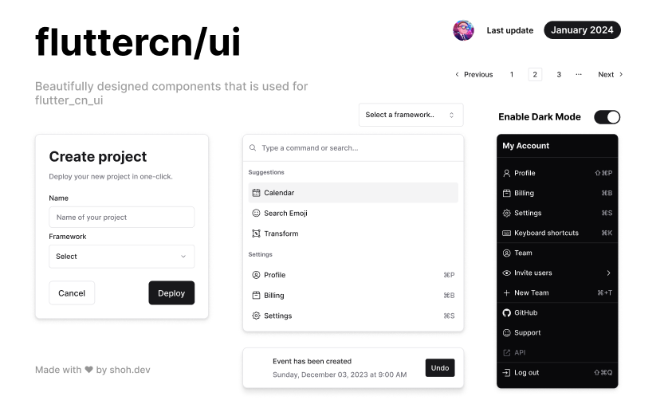

# shadcn-ui for Flutter

Welcome to the Flutter port of [shadcn-ui](https://ui.shadcn.com/), a component library originally made for React developers. This project aims to bring the power and flexibility of shadcn-ui to Flutter developers, allowing them to easily integrate beautiful and customizable components into their Flutter applications.

## Documentation

Explore the comprehensive documentation for `fcnui` on the [docs](https://fcnui.shoh.dev/docs/get_started).

Whether you're a beginner getting started with `fcnui` or an experienced developer looking for detailed information on specific components, the `fcnui` Docs website has you covered. Dive deep into the world of Flutter development with `fcnui` and unleash the full potential of your applications.

Visit [fcnui.shoh.dev](https://fcnui.shoh.dev) to access the documentation and accelerate your Flutter development journey!

## Packages

This project consists of the following packages:

### cli

The `cli` package is a Dart-based CLI tool that streamlines the process of working with `fcnui`. It contains all the necessary commands to initialize a project, add new components.

### fcnui_base

The `fcnui_base` package is the heart of `fcnui`. Written in Dart (Flutter), it provides developers with a comprehensive set of dependencies.

### registry

The `registry` package is a Flutter application designed for testing `fcnui` components individually. This app serves as a visual playground where developers can explore and interact with each component in isolation. By including the `fcnui_base`, the registry ensures that components are thoroughly tested and ready for integration into real-world projects.

### ui

The `ui` package is a `Next.js` application that complements `fcnui`. It provides an `API` for all the components in `JSON` format, enabling seamless integration with the `cli` tool.

That's it! You're now ready to leverage the power of `fcnui` in your projects. Happy coding! 🚀

### Available Components

- [ ] Avatar
- [ ] Badge
- [x] [Button](https://fcnui.shoh.dev/docs/components/button)
- [x] [Card](https://fcnui.shoh.dev/docs/components/card)
- [ ] Checkbox 🚀 (WIP)
- [ ] Combobox
- [ ] Command
- [ ] Context Menu
- [ ] Data Table 🚀
- [ ] Dialog
- [ ] Dropdown Menu 🚀 (WIP)
- [x] [Form](https://fcnui.shoh.dev/docs/components/form)
- [x] [Input](https://fcnui.shoh.dev/docs/components/input)
- [ ] Menu Bar
- [ ] Navigation Menu
- [ ] Pagination
- [ ] Progress Bar
- [ ] Radio Group 🚀
- [ ] Resizable
- [ ] Select 🚀 (WIP)
- [ ] Sheet
- [ ] Skeleton
- [ ] Slider
- [ ] Switch 🚀 (WIP)
- [ ] Table 🚀
- [ ] Tabs 🚀
- [ ] Textarea
- [ ] Toast
- [ ] Toggle 🚀 (WIP)
- [ ] Toggle Group 🚀 (WIP)
- [ ] Tooltip

> 🚀 - Very Important
> 
> WIP - Work in Progress